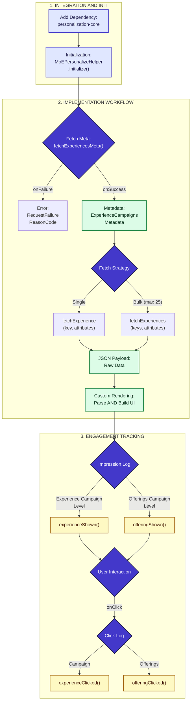

<Info>
  **Information**

  You can now get notified whenever MoEngage releases a new version of the Android Native SDK. For more information, refer to [Subscribe to MoEngage SDK Releases](/developer-guide/release-notes/subscribe-to-moengage-sdk-releases/subscribe-to-mo-engage-sdk-releases).
</Info>

  
Module Status Legend

  <ul style={{ listStyle: 'none', paddingLeft: '0' }}>
    <li>■ Updated: Module version has been updated in this release.</li>
    <li>■ Unchanged: Module remains on the previous version.</li>
    <li>■ Deprecated: Module is deprecated and will be removed in a future release.</li>
  </ul>

# 15th April 2026

  ### Release Summary

  | Catalog Version | BOM Version | Modules                                                                                                                                                                                                                                                                                                                                                                                                                                                                                                                                                                                                                                                                                          | Dependencies                                                                                                 |
  | :-------------- | :---------- | :----------------------------------------------------------------------------------------------------------------------------------------------------------------------------------------------------------------------------------------------------------------------------------------------------------------------------------------------------------------------------------------------------------------------------------------------------------------------------------------------------------------------------------------------------------------------------------------------------------------------------------------------------------------------------------------------- | :----------------------------------------------------------------------------------------------------------- |
  | \[Version]      | \[Version]  | • moe-android-sdk: \[Version] • inapp: \[Version] • push-amp: \[Version] • realtime-trigger: 4.3.0 • cards-core: \[Version] • cards-ui: \[Version] • geofence: 5.2.0 • richNotification: \[Version] • inbox: 4.3.0 • pushkit: \[Version] • inbox-ui: 4.3.0 | AGP: \[Version] Kotlin: \[Version] Compile SDK Version: \[Version] Gradle Version: \[Version] |

## Core SDK \[Version\]

What's New

- **Personalization**: Introducing the MoEngage Personalize SDK, a secure framework to fetch personalized campaign content and track user impressions and clicks at both the campaign and individual offering levels.

 

Improvements

- Internal Improvements.

## InApp \[Version\]

Improvements

- **Predictive Back Gesture**: Added support for the predictive back gesture.
- **WebView Flags**: Introduced a configuration option for controlling WebView flags.

## Push \[Version\]

Improvements

- **Delayed Notifications**: Added auto-dismiss handling for delayed notifications.

## Cards \[Version\]

Fixes

- Fixed a memory leak issue in the Cards module.

## Rich Notification \[Version\]

Fixes

- Internal fixes.

# 25th March 2026

  ### Release Summary

  | Catalog Version                                                                             | BOM Version                                                                             | Modules                                                                                                                                                                                                                                                                                                                                                                                                                                                                                                                                                                                                                                                                                                                                                                                                                                                                                                                                                                                                                                                                                                                                                                     | Dependencies                                                                          |
  | :------------------------------------------------------------------------------------------ | :-------------------------------------------------------------------------------------- | :-------------------------------------------------------------------------------------------------------------------------------------------------------------------------------------------------------------------------------------------------------------------------------------------------------------------------------------------------------------------------------------------------------------------------------------------------------------------------------------------------------------------------------------------------------------------------------------------------------------------------------------------------------------------------------------------------------------------------------------------------------------------------------------------------------------------------------------------------------------------------------------------------------------------------------------------------------------------------------------------------------------------------------------------------------------------------------------------------------------------------------------------------------------------------- | :------------------------------------------------------------------------------------ |
  | [7.1.0](https://github.com/moengage/android-dependency-catalog/releases/tag/catalog-v7.1.0) | [2.1.0](https://github.com/moengage/android-dependency-catalog/releases/tag/bom-v2.1.0) | • moe-android-sdk: 14.08.00 • inapp: 10.1.0 • push-amp: 6.4.0 • realtime-trigger: 4.4.0 • cards-core: 3.4.0 • cards-ui: 3.4.0 • geofence: 5.3.0 • richNotification: 6.5.0 • inbox:4.4.0  • pushkit: 6.4.0 • inbox-ui: 4.4.0  • security: 4.3.0  • encryptedStorage: 3.3.0 | AGP: 8.13.2 Kotlin: 1.9.23 Compile SDK Version: 34 Gradle Version: 8.9 |

## Core SDK 14.08.00

Fixes

- Resolved an issue with self-handled push notifications where the same campaign was delivered twice (once via FCM and once via Push-Amp).

 

Improvements

- Android Gradle Plugin Version updated from **8.7.3** to **8.13.2**.

## InApp 10.1.0

What's New

- Added support for **Edge-to-Edge** display.

 

Fixes

- Internal bugfixes for Orientation-related rendering.

 

Improvements

- Android Gradle Plugin Version updated from **8.7.3** to **8.13.2**.

## Push Amp 6.4.0

Improvements

- Android Gradle Plugin Version updated from **8.7.3** to **8.13.2**.

## Realtime Trigger 4.4.0

Improvements

- Android Gradle Plugin Version updated from **8.7.3** to **8.13.2**.

## Cards Core 3.4.0

Fixes

- Internal fixes.

 

Improvements

- Android Gradle Plugin Version updated from **8.7.3** to **8.13.2**.

## Cards UI 3.4.0

Improvements

- Android Gradle Plugin Version updated from **8.7.3** to **8.13.2**.

## Geofence 5.3.0

Improvements

- Android Gradle Plugin Version updated from **8.7.3** to **8.13.2**.

## Rich Notification 6.5.0

Improvements

- Android Gradle Plugin Version updated from **8.7.3** to **8.13.2**.

## Inbox 4.4.0

Improvements

- Android Gradle Plugin Version updated from **8.7.3** to **8.13.2**.

## Pushkit 6.4.0

Improvements

- Android Gradle Plugin Version updated from **8.7.3** to **8.13.2**.

## Inbox UI 4.40

Improvements

- Android Gradle Plugin Version updated from **8.7.3** to **8.13.2**.

## Security 4.3.0

Improvements

- Android Gradle Plugin Version updated from **8.7.3** to **8.13.2**.

## Encrypted Storage 3.3.0

Improvements

- Android Gradle Plugin Version updated from **8.7.3** to **8.13.2**.

# 11th March 2026

  ### Release Summary

  | Catalog Version                                                                             | BOM Version                                                                              | Modules                                                                                                                                                                                                                                                                                                                                                                                                   | Dependencies                                                                         |
  | :------------------------------------------------------------------------------------------ | :--------------------------------------------------------------------------------------- | :-------------------------------------------------------------------------------------------------------------------------------------------------------------------------------------------------------------------------------------------------------------------------------------------------------------------------------------------------------------------------------------------------------- | :----------------------------------------------------------------------------------- |
  | [7.0.0](https://github.com/moengage/android-dependency-catalog/releases/tag/catalog-v7.0.0) | [1.6.0 ](https://github.com/moengage/android-dependency-catalog/releases/tag/bom-v2.0.0) | • moe-android-sdk: 14.07.00 • inapp: 9.10.0 • push-amp: 6.3.0 • realtime-trigger: 4.3.0 • cards-core: 3.3.0 • cards-ui: 3.3.0 • geofence: 5.2.0 • richNotification: 6.4.1 • inbox: 4.3.0 • pushkit: 6.3.0 • inbox-ui: 4.3.0 | AGP: 8.7.3 Kotlin: 1.9.23 Compile SDK Version: 35 Gradle Version: 8.9 |

## Core SDK 14.07.00

Fixes

- Fixed an issue where a blank notification was shown on certain OEMs upon clicking the last notification within a notification group.

## InApp 9.10.0

What's New

- **Callback-based APIs**: Introduced new public APIs to fetch self-handled In-Apps. These APIs provide a `FailureCallback` instead of returning `null`, ensuring better error handling.

 

Deprecations

- **Listener-based APIs**: All listener-based APIs for self-handled In-Apps are now deprecated and will be removed in version **11.0.0**. We recommend migrating to the new Success/Failure callback-based APIs.

| Deprecated APIs | Replacement APIs |
| :-- | :-- |
| `getSelfHandledInApp(context, SelfHandledAvailableListener)` | `getSelfHandledInApp(context, SuccessCallback<SelfHandledCampaignData?>, FailureCallback)` |
| `getSelfHandledInApps(context, SelfHandledCampaignsAvailableListener)` | `getSelfHandledInApps(context, SuccessCallback<SelfHandledCampaignsData?>, FailureCallback)` |

For more information, refer to the [Self-Handled InApps](/developer-guide/android-sdk/in-app-messages/in-app-nativ).

# 4th February 2026

  ### Release Summary

  | Catalog Version                                                                             | BOM Version                                                                             | Modules                                                                                                                                                                                                                                                                                                                                    | Dependencies                                                         |
  | :------------------------------------------------------------------------------------------ | :-------------------------------------------------------------------------------------- | :----------------------------------------------------------------------------------------------------------------------------------------------------------------------------------------------------------------------------------------------------------------------------------------------------------------------------------------- | :------------------------------------------------------------------- |
  | [6.5.1](https://github.com/moengage/android-dependency-catalog/releases/tag/catalog-v6.5.1) | [1.5.1](https://github.com/moengage/android-dependency-catalog/releases/tag/bom-v1.5.1) | • moe-android-sdk: 14.06.00 • inapp: 9.9.1 • push-amp: 6.3.0 • realtime-trigger: 4.3.0 • cards-core: 3.3.0 • cards-ui: 3.3.0 • geofence: 5.2.0 • richNotification: 6.4.1 • inbox: 4.3.0 • pushkit: 6.3.0 • inbox-ui: 4.3.0 | AGP: 8.7.3 Kotlin: 1.9.23 Compile SDK: 35 Gradle: 8.9 |

## InApp 9.9.1

Fixes

- Fixed click and lifecycle callback execution issues.

# 29th January 2026

  ### Release Summary

  | Catalog Version                                                                             | BOM Version                                                                             | Modules                                                                                                                                                                                                                                                                                                                                                                                                                                                                | Dependencies                                                         |
  | :------------------------------------------------------------------------------------------ | :-------------------------------------------------------------------------------------- | :--------------------------------------------------------------------------------------------------------------------------------------------------------------------------------------------------------------------------------------------------------------------------------------------------------------------------------------------------------------------------------------------------------------------------------------------------------------------- | :------------------------------------------------------------------- |
  | [6.5.0](https://github.com/moengage/android-dependency-catalog/releases/tag/catalog-v6.5.0) | [1.5.0](https://github.com/moengage/android-dependency-catalog/releases/tag/bom-v1.5.0) | • moe-android-sdk: 14.06.00 • inapp: 9.9.0 • richNotification: 6.4.1 • push-amp: 6.3.0 • realtime-trigger: 4.3.0 • cards-core: 3.3.0 • cards-ui: 3.3.0 • geofence: 5.2.0 • inbox: 4.3.0 • pushkit: 6.3.0 • inbox-ui: 4.3.0 | AGP: 8.7.3 Kotlin: 1.9.23 Compile SDK: 35 Gradle: 8.9 |

## Core MoE SDK 14.06.00

What's New

- **Self-Handled Background Push**: Added support for the Self-Handled Background Push template. Refer to the [doc](/developer-guide/android-sdk/Push/Advanced/Push-Display-Handled-by-Application#h_manual_handling) for more information.

## InApp 9.9.0

Improvements

- Internal improvements.

## RichNotification 6.4.1

Fixes

- Sticky notification with notification id not removed on dismiss click.

# 20th January 2026

  ### Release Summary

  | Catalog Version                                                                             | BOM Version                                                                             | Modules                                                                                                                                                                                                                                                                                                                                                                                                  | Dependencies                                                         |
  | :------------------------------------------------------------------------------------------ | :-------------------------------------------------------------------------------------- | :------------------------------------------------------------------------------------------------------------------------------------------------------------------------------------------------------------------------------------------------------------------------------------------------------------------------------------------------------------------------------------------------------- | :------------------------------------------------------------------- |
  | [6.4.1](https://github.com/moengage/android-dependency-catalog/releases/tag/catalog-v6.4.1) | [1.4.1](https://github.com/moengage/android-dependency-catalog/releases/tag/bom-v1.4.1) | • moe-android-sdk: 14.05.01 • inapp: 9.8.1 • push-amp: 6.3.0 • realtime-trigger: 4.3.0 • cards-core: 3.3.0 • cards-ui: 3.3.0 • geofence: 5.2.0 • richNotification: 6.4.0 • inbox: 4.3.0 • pushkit: 6.3.0 • inbox-ui: 4.3.0 | AGP: 8.7.3 Kotlin: 1.9.23 Compile SDK: 35 Gradle: 8.9 |

## Core SDK 14.05.01

Fixes

Fixed an issue where some constants were causing unresolved errors in specific build configurations.

## InApp 9.8.1

Fixes

Fixed an issue where some constants were causing unresolved errors in specific build configurations.

# 19th January 2026

  ### Release Summary

  | Catalog Version                                                                             | BOM Version                                                                             | Modules                                                                                                                                                                                                                                                                                                                                                                                                                                                                                                                                                                                                                                                                                                                                                                                                                                                                                                                                                                                | Dependencies                                                         |
  | :------------------------------------------------------------------------------------------ | :-------------------------------------------------------------------------------------- | :------------------------------------------------------------------------------------------------------------------------------------------------------------------------------------------------------------------------------------------------------------------------------------------------------------------------------------------------------------------------------------------------------------------------------------------------------------------------------------------------------------------------------------------------------------------------------------------------------------------------------------------------------------------------------------------------------------------------------------------------------------------------------------------------------------------------------------------------------------------------------------------------------------------------------------------------------------------------------------- | :------------------------------------------------------------------- |
  | [6.4.0](https://github.com/moengage/android-dependency-catalog/releases/tag/catalog-v6.4.0) | [1.4.0](https://github.com/moengage/android-dependency-catalog/releases/tag/bom-v1.4.0) | • moe-android-sdk: 14.05.00 • inapp: 9.8.0 • push-amp: 6.3.0 • realtime-trigger: 4.3.0 • cards-core: 3.3.0 • cards-ui: 3.3.0 • geofence: 5.2.0 • richNotification: 6.4.0 • inbox: 4.3.0 • pushkit: 6.3.0 • inbox-ui: 4.3.0 | AGP: 8.7.3 Kotlin: 1.9.23 Compile SDK: 35 Gradle: 8.9 |

## All Modules

Improvements

MoEngage has optimized memory usage on app launch.

## Core SDK 14.05.00

What's New

- **Custom Proxy Domain**: Introduced support for Custom Proxy Domains to route SDK traffic through a customer-owned subdomain for bypassing ad blockers and private DNS services. For more information, refer [here](/hc/en-us/articles/45199747520148).

## InApp 9.8.0

What's New

- **Frequency Capping:** Introduced frequency capping to limit the number of campaigns displayed to users.

## richNotification 6.4.0

What's New

Updates to support Custom Proxy Domain.

## cards-ui 3.3.0

What's New

Updates to support Custom Proxy Domain.

## pushkit 6.3.0

What's New

Updates to support Custom Proxy Domain.